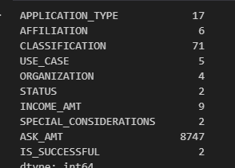
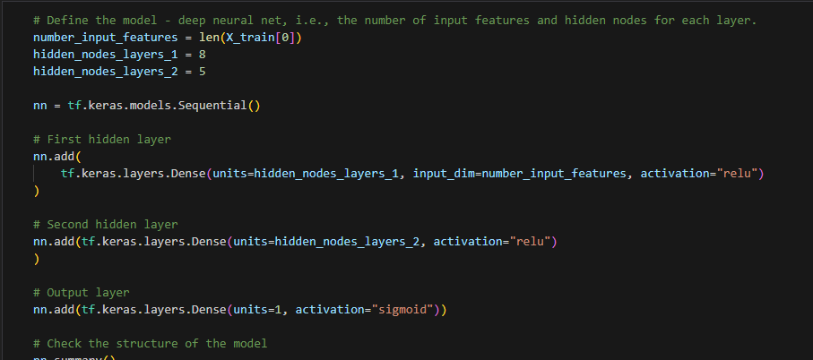
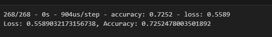
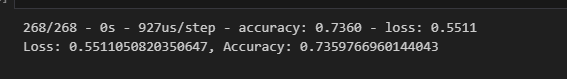
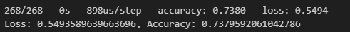

# deep-learning-challenge

# Alphabet_Soup_Deep_Learning

## Overview
The purpose of this project use the features in the provided dataset to create a binary classifier that can predict whether applicants will be successful if funded by Alphabet Soup.

## Data Processing
- The target for the model is IS-SUCCESSFUL, using the variables:

- The features for the model are APPLICATION TYPE & CLASSIFICATION

- The variables removed from the model are EIN and NAME

## Compiling, Training, and Evaluating the Model

- The model had 2 layers with 8 and 5 neurons with the RELU activaction function. The ouput layer used a Sigmoid function.
  

- THe ReLU function was used for its general pupose use and to alleviate the vanishing gradient with a Sigmoid function on the output for the binary classification. 

## Performance
- Target Performance was not hit.

### Attempt #1

### Attempt #2
- Edited feature cutoffs.
- Added a new hidden layer

### Attempt #3
- Edited feature cutoffs.
- Added more nodes to existing layers
- Added sigmoid function onto hidden layer

## Summary
The model did not hit the target in three attempts at 73.8% accuracy. With some tweaks to the layers, neuron amounts, and activation function, it may hit the target. More data could also be helpful. If not the current data could be further manipulated and additional columns dropped to hit the target. 
